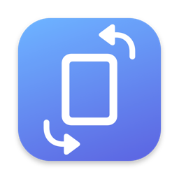

# DesktopRotation

<p align="center"></p>

macOS 菜单栏小工具：点一下，把主显示器的旋转在「标准」和「90°」之间切换（等同于 系统设置 → 显示器 → 旋转）。只驻留在顶部菜单栏，不出现在 Dock。

- **左键点击图标**：旋转 / 恢复
- **右键点击图标**：显示当前状态、退出
- **全局快捷键**：⌃⌘⇧R（Control + Command + Shift + R）

## 构建

只需要 Xcode Command Line Tools：

```sh
./build.sh          # 生成 build/DesktopRotation.app
open build/DesktopRotation.app
```

可以把 `build/DesktopRotation.app` 拖到 `/Applications`。如需开机自启，在 系统设置 → 通用 → 登录项 里添加即可。

## 实现说明

- 旋转通过系统私有框架 `MonitorPanel.framework`（`MPDisplay.orientation`）完成，与系统设置使用的是同一条路径，Apple Silicon 可用。运行时 `dlopen`，不做静态链接。
- 快捷键使用 Carbon `RegisterEventHotKey`，不需要辅助功能权限。
- 使用私有 API，因此只能本地 ad-hoc 签名，不适合上架 App Store。
